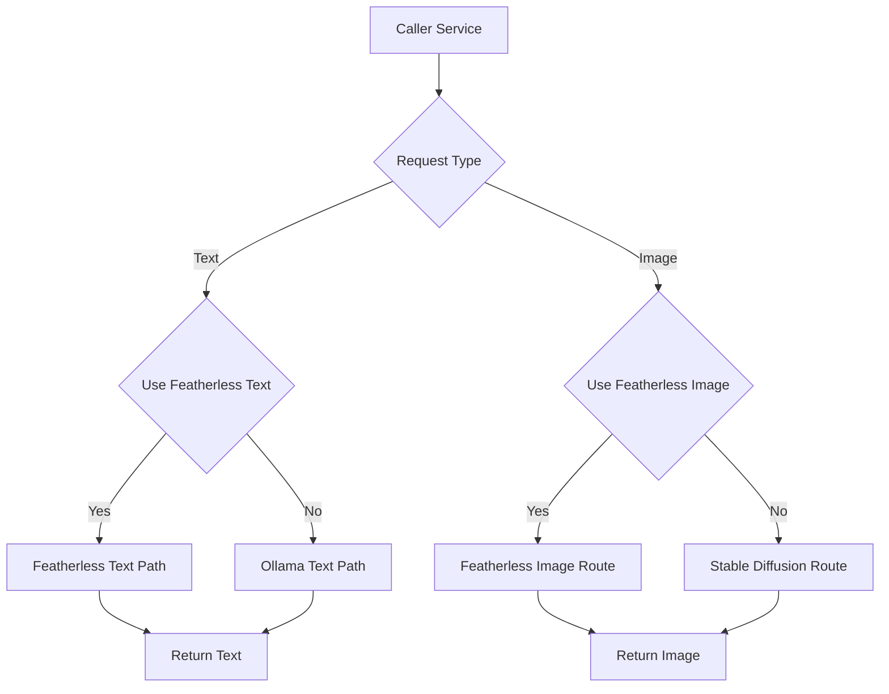

# `ai_client.py`

## Architecture
- Pattern: `Facade + Environment-based strategy router`.
- Centralizes all AI calls for text/chat/image.
- Routes backend by settings:
  - `IS_PRODUCTION` or `USE_FEATHERLESS_TEXT` -> Featherless via LangChain/OpenAI-compatible API.
  - otherwise -> local Ollama chat endpoint.
  - Image generation currently uses Stable Diffusion in both modes (production path falls back to SD).
  - Additional option: Amazon Bedrock — set `USE_BEDROCK_TEXT=True` and/or `USE_BEDROCK_IMAGE=True` in `server/.env` to route LLM and image requests to Bedrock models (defaults: `BEDROCK_LLM_MODEL=amazon/nova-lite`, `BEDROCK_IMAGE_MODEL=amazon/nova-canvas`).

## Workflow Diagram


## LLM Call Points
- `_ollama_generate(prompt, system_prompt, json_mode, model)`
  - Endpoint: `OLLAMA_API_URL` transformed to `/api/chat`
  - Payload includes `messages` and optional `format: json`.
- `_featherless_generate(prompt, system_prompt, json_mode, model)`
  - Uses `get_langchain_llm()` and invokes with `SystemMessage` + `HumanMessage`.
  - Adds strict JSON instruction when `json_mode=True`.
 - `_bedrock_generate_text(...)` / `_bedrock_generate_image(...)`
   - When Bedrock is enabled the service directly invokes the `bedrock-runtime` via `boto3`.
   - Configure credentials via `AWS_ACCESS_KEY_ID`, `AWS_SECRET_ACCESS_KEY`, and `AWS_REGION` in `server/.env`.
- `get_langchain_llm(temperature)`
  - Production: `ChatOpenAI` with Featherless base URL.
  - Development: `ChatOllama`.
  - If Bedrock text routing is enabled the code will prefer Bedrock helpers for direct invokes instead of a LangChain wrapper.

## Prompt Handling
- This service does not define domain prompts itself.
- It forwards `prompt` and optional `system_prompt` from caller services.
- JSON mode appends:
```text
Return only valid JSON. Do not add markdown, commentary, or code fences.
```
